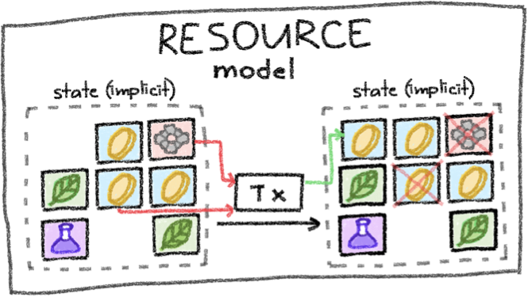

# Anoma's State Model

Anoma organizes state in a resource model.

<figure><figcaption>
Schematic depiction of state as resources.
</figcaption></figure>

## Comparison to other State Models

### Account Model

* State is explict and global
* Example: An Ethereum smart contract containing value (e.g., `uint256 count`) or a account balance mapping (`mapping(address => uint256) balanceOf`).
* An application must be deployed to each chain specifically.
* Cross-chain apps require sophisticated bridging and code changes.

<figure><figcaption>
Schematic depiction of the account model.
</figcaption></figure>

### UTXO Model

* State is implicit and comprised of all unspent transaction outputs (UTXOs)
* Examples: Bitcoin or Zcash transactions
* The predicate determining if it is allowed to spent an UTXO is always the same
* Arbitrary applications are difficult/not possible

<figure><figcaption>
Schematic depiction of the UTXO model.
</figcaption></figure>

### Resource Model

* State is implicit and comprised of all unspent resources
* Predicates and data attached to resources can be arbitrary
* Arbitrary applications and general intents are enabled

<figure><figcaption>
Schematic depiction of the resource model.
</figcaption></figure>

## Affordances

This enables[^1]

* Heterogeneous trust
  * Resources can live on different controllers (e.g., L1's, L2's, three friends in a LAN).
  * A transaction can consume a resource on controller A and create it on controller B.
* Information flow control
  * Transactions can be sent transparent, shielded, or private just by setting a flag
* Intent-level Composability
  * Intents (unbalanced transactions) can be composed and settled across different applications and chains

[^1]: https://ethresear.ch/t/rfc-draft-anoma-as-the-universal-intent-machine-for-ethereum/19109.
