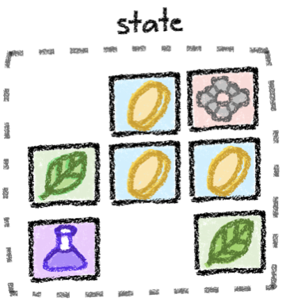

# State Model

A unique feature of the Anoma protocol is its state model. Anoma organizes state in atomic units called [resources](../resources/) being created and consumed in [transactions](../transactions/). This **resource model** generalizes the UTXO model: Resources are UTXOs but with arbitrary state and logic predicates. The latter express the constraints under which they can be created and consumed.

<figure><figcaption>
A state space containing multiple resource objects: three coins, two leafs, a gear, and a potion.
</figcaption></figure>

<figure><figcaption>
A state transition consuming a coin and a gear resource to create a coin as well as an <a href="../resources/#ephemeral-resources">ephemeral</a> gear resource, the latter of which is not being shown here.
</figcaption></figure>

## Affordances

Anoma's unique state model enables the following affordances to developers and users

* Heterogeneous trust
  * Resources can live on different controllers (e.g., L1's, L2's, three friends in a LAN).
  * A transaction can consume a resource on controller A and create it on controller B, thus enabling fluent cross-chain transfers.
* Information flow control
  * Transactions can be sent transparent, shielded, or private just by setting a flag.
* Intent-level Composability
  * Intents (unbalanced transactions) can be composed and settled across different applications and chains
