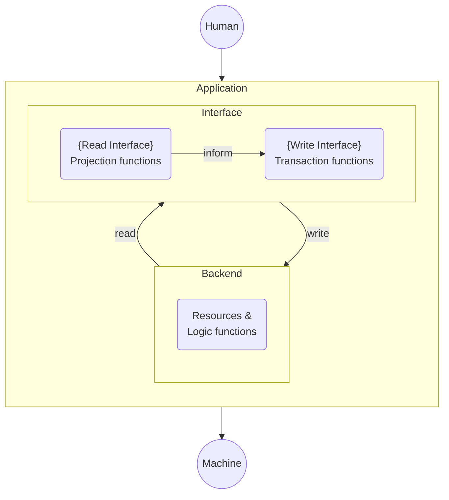

# Applications

Applications consist of application state and logic.

* **State** is modelled as resources and by the arbitrary data they contain.
* **Logic** is modelled as resource logic functions expressing the predicates required for a resource to be created and consumed in a transaction.
* Users transition application state by executing transactions on a distributed ledger.

**All** **resources** related to an application **and corresponding resource logic functions** make up the [**application backend**](backend.md).

Instead of creating and consuming resources and providing all data required in the transaction object manually, users interact with an [**application interface**](interface.md) consisting of a read- and write-related part.

