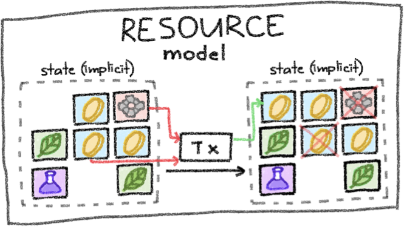

# Backend

Resources are not formally associated with applications. However, resources related to an application can be identified and queried by their kind (see [indexing.md](../services/indexing.md "mention")).

Accordingly, consumed resources constitute **historical application state**, whereas created (i.e., unconsumed) resources constitute the **current application state**. The resource logics associated with the current application state constrain the future application state space the application can transition into via transactions.

<figure><figcaption>
Resources being created and consumed in a transaction. 
</figcaption></figure>


**Example: Token Logic Constraints**\
A token resource might require authorization (usually a signed message) by its

* originator when created for the first time or&#x20;
* current owner when transferred.

Additionally, the token can also ensure a fixed supply, which means that the total quantity of all resources of this specific kind cannot change.


Instead of manually constructing transaction objects creating and consuming resources, users interact with an [**application interface**](interface.md).
