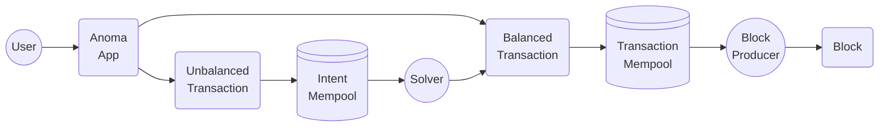

# Transactions

A transaction transitions state by consuming and creating resources on execution. \
This requires the transaction to be **balanced** (i.e., have a [delta value](delta.md) of zero) **&** **valid** (i.e., all [resource logics](../resources/logic.md) must be valid and resources must be [resource machine compliant](../page/)).

[**Balanced transactions**](balanced-transactions.md) are sent to a **transaction mempool**, where they can be picked up by a block producer that verifies and executes them in a determined order, thus updating the state. **Unbalanced transactions**, a.k.a. [**intents**](intents.md) are sent to an **intent mempool** to be processed by [solvers](../services/solving.md). Solvers compose unbalanced transactions to produce balanced transactions.

[Applications](../applications/) provide so-called [transaction functions](../applications/interface.md#transaction-functions) as part of their interface producing balanced or unbalanced transactions, a.k.a. [intents](intents.md). The underlying transaction object contains standardized data fields, which are defined in the [Anoma specs](https://specs.anoma.net/latest/arch/system/state/resource_machine/data_structures/transaction/transaction.html).
